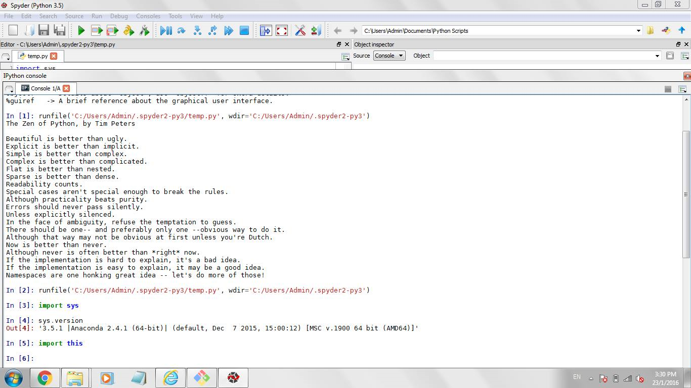

UECM3033 Assignment #1 Report
========================================================

- Prepared by: Chai Kun Ting
- Tutorial Group: T3

--------------------------------------------------------

## Task 1 -- setup a github repository

The reports, codes and supporting documents are uploaded to Github at: 

[https://github.com/chaikt12/UECM3033_assign1.git](https://github.com/chaikt12/UECM3033_assign1.git)

---------------------------------------------------------

## Task 2 -- setup python

Following is a screenshot of my python software

------------------------------------------------------------

## Task 3 -- modify and run Python script

1. hexadecimal value of my student ID 0x13d9c1

2.definite integral that i chosen
$$\int_0^{\pi} e^{x}sin(x) dx = \frac{1}{2}(1+e^\pi)$$

3. 10 linear equations
\begin{align*}
1x_0+2x_1+	3x_2+	4x_3+	5x_4+6x_5+7x_6+8x_7+9x_8+10x_9 &=385\\
2x_0+3x_1+	4x_2+	5x_3+	6x_4+7x_5+8x_6+9x_7+10x_8+11x_9 &=440\\
11x_0+12x_1+	13x_2+	14x_3+	15x_4+16x_5+17x_6+18x_7+19x_8+20x_9
&=935,\\
8x_0-7x_1-6x_2+5x_3-4x_4-3x_5+2x_6-1x_7-9x_8-10x_9 &=-217\\
7x_0+6x_1+	13x_2+	4x_3+	2x_4+15x_5-8x_6-5x_7+12x_8+13x_9 &=316\\
3x_0-4x_1+	5x_2-6x_3+6x_4+6x_5-4x_6+8x_7-8x_8+1x_9 &=26\\
4x_0-4x_1+	2x_2-8x_3+	4x_4+5x_5+6x_6+5x_7+12x_8-11x_9 &=100\\
-7x_0+4x_1+	3x_2+	5x_3+	6x_4+7x_5+3x_6+2x_7+3x_8-4x_9 &=126\\
7x_0+4x_1+	7x_2+	8x_3-7x_4+5x_5+3x_6-5x_7+2x_8+4x_9 &=66\\
2x_0+4x_1-6x_2-6x_3+	9x_4+2x_5+8x_6+3x_7+9x_8+12x_9 &=306\\
\end{align*}

-----------------------------------

last modified: change your date here
